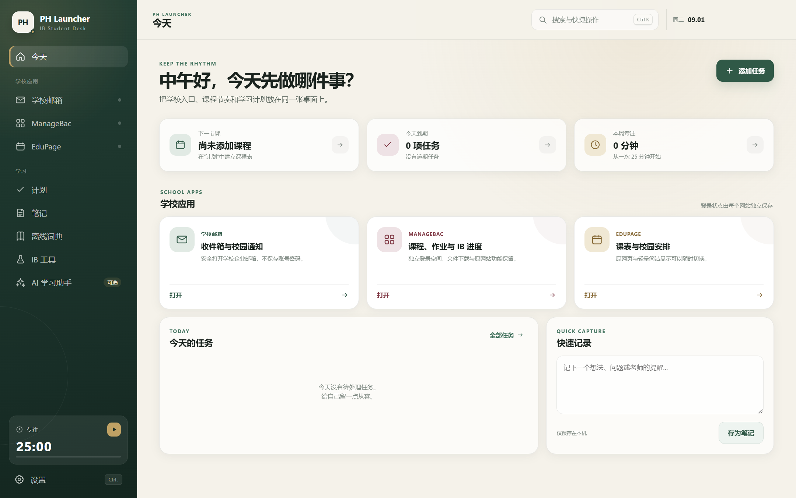

# PH Launcher

PH Launcher 是面向平和 IB 学生的隐私优先桌面学习工作台。它把学校邮箱、ManageBac、EduPage、课程计划、笔记、提醒、专注计时、离线词典、IB 工具和可选 AI 集中在一个应用中。

> PH Launcher 是独立学生项目，不是上海市民办平和学校、ManageBac、EduPage、网易或 Ollama 的官方产品，也不使用校徽。网站与产品名称归各自权利人所有。



## 发布状态

| 平台 | 状态 | 说明 |
| --- | --- | --- |
| Windows x64 | [v0.4.1 已发布](https://github.com/XKRyan/PH-Launcher/releases/tag/v0.4.1) | 提供安装版与免安装版，已经完成自检、三站连通、安装及卸载验证。首次提交后由固定版本的一次性工作流生成并上传；若 Release 页面暂未出现，表示工作流仍在执行。 |
| macOS | 开发中 | 尚无面向同学分发的正式版本；不要把未签名、未公证的测试包当作正式版。 |

Windows v0.4.1 当前没有商业代码签名证书，Windows 可能显示“未知发布者”。请只从本仓库的 Release 获取，并使用同一 Release 附带的 `PH-Launcher-0.4.1-SHA256.txt` 核对下载文件。该清单由发布工作流对实际上传的文件生成，避免把重新构建前的旧校验值误用于新文件。

## 主要功能

- 在相互隔离的登录空间中打开学校邮箱、ManageBac 与 EduPage。
- 为已确认页面提供可关闭的“简洁显示”。
- 任务、课程表、上课提醒、笔记、专注计时与学习统计。
- 77 万余词条的离线英汉词典。
- IB 指令词速查、写作统计、成绩试算与 EE／TOK／IA 里程碑。
- 可配置的窗口内与全局快捷键。
- 完全可选的本地 AI 或 API AI；本地模式按电脑配置推荐模型。
- “AI 操作启动器”默认关闭，所有任务、笔记和课表写入都先预览、再由用户确认。

更完整的使用说明见 [使用指南](docs/使用指南.md)，v0.4.1 的修复与安全边界见 [发布与安全说明](docs/PH-Launcher-0.4.1-发布与安全说明.md)。

## 隐私与安全

- PH Launcher 不读取或保存学校网站密码；Cookie 和登录状态由各网站的独立会话保存。
- 笔记、任务、课程表和设置默认保存在当前系统用户目录，并尽可能使用系统提供的本地加密能力。
- AI 默认关闭。API 模式会把用户主动提交或明确授权的内容发送给所配置的服务商。
- AI 不获得网站密码、Cookie、验证码、API Key、任意文件系统或任意网页脚本权限。
- EduPage 课表导入只生成预览并合并课程，不会因空结果删除已有课程。

发现安全问题时，请先阅读 [安全政策](SECURITY.md)，不要在公开 issue 中提交账号、Cookie、密钥或学生个人信息。

## 从源码运行

需要 Windows 10/11、Node.js 22 和 Git。

```powershell
git clone https://github.com/XKRyan/PH-Launcher.git
Set-Location PH-Launcher
npm ci
git clone --depth 1 https://github.com/skywind3000/ECDICT.git .cache/ECDICT-meta
npm run dictionary
npm test
npm run self-test
npm start
```

`assets/dictionary/ecdict.db` 约 126 MiB，超过 GitHub 普通 Git 文件限制，因此不会进入提交历史。它由 MIT 许可的 ECDICT 数据通过 `npm run dictionary` 在本机生成。完整的 v0.4.1 原始源码包会作为 Release 附件提供。

构建 Windows 免安装版与安装版：

```powershell
npm run dist
npm run dist:installer
```

构建结果位于 `release/`。不要提交安装包、模型、词典数据库、缓存、证书、密钥或用户数据。

## 项目结构

```text
electron/   Electron 主进程、网站隔离、AI、词典与课表提取
src/        最终用户界面
scripts/    图标、词典与构建辅助脚本
tests/      核心安全边界与功能测试
assets/     应用图标和第三方许可证
docs/       使用、发布和平台开发文档
```

## 参与贡献

提交前请阅读 [CONTRIBUTING.md](CONTRIBUTING.md)。本项目采用 [MIT License](LICENSE)；ECDICT 等第三方组件见 [THIRD_PARTY_NOTICES.md](THIRD_PARTY_NOTICES.md)。
